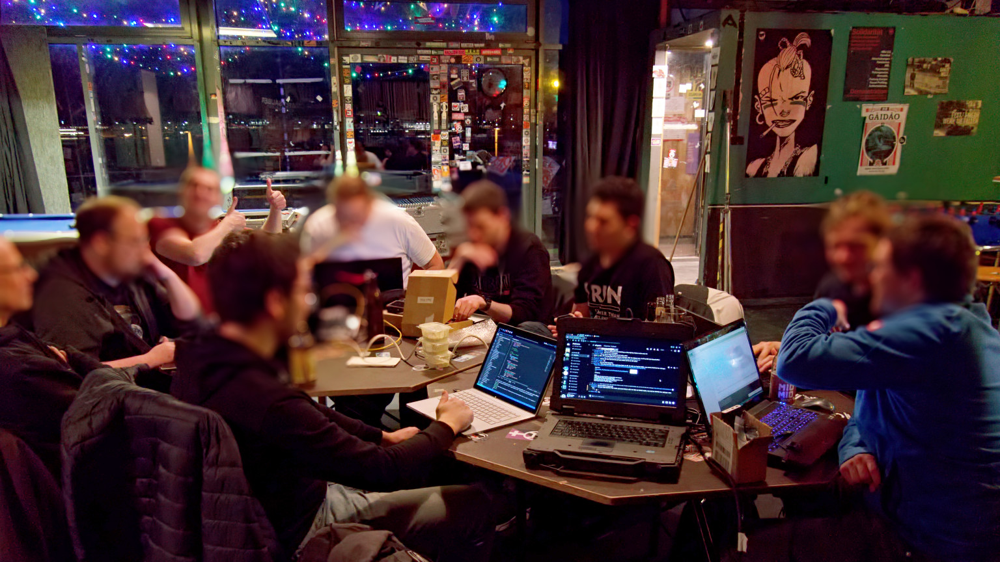

# /bin/hacken

## Chaostreff

Wir treffen uns dienstags um 19 Uhr im [JuZ Bingen](https://www.juz-bingen.de/).  

[Mainzer Straße 103a](https://www.openstreetmap.org/node/1613115329)  
Der Eingang ist auf der Rückseite, links durchs Tor.  

  

[Chaostreffs](https://www.ccc.de/en/club/chaostreffs) sind lockere Zusammentreffen von Hackern, die sich dem [CCC](https://www.ccc.de/) nahefühlen.  
Wir sind meistens 5-10 Personen, es gibt Getränke, und oft bestellen wir auch Essen (siehe Discord). Ansonsten ist es einfach ein lockeres beisammensein und sich unterhalten. Manchmal spielen wir auch Billard. Komm gerne vorbei!

## Kommunikationskanäle

* [Discord Server](https://discordapp.com/invite/fNzyjae)
* Email: [info@binhacken.de](mailto:info@binhacken.de)
* Weiteres ist in arbeit 

## Über uns

  

Wir sind eine Gruppe technikbegeisterter Menschen, die sich regelmäßig zum Austausch und zur Weiterbildung treffen und sich das Ziel gesetzt haben, einen Hackerspace zu gründen.  
Unsere Treffen begannen im Jahr 2019 im AStA der TH Bingen, da viele von uns Studierende an der Hochschule sind. 
Aufgrund der Corona-Pandemie mussten wir unsere Treffen leider einstellen, nutzen aber unseren [Discord-Server](https://discordapp.com/invite/fNzyjae) weiter als Online-Treffpunkt, der auch als Lernplattform von anderen Studierenden benutzt wird.  
Glücklicherweise ist es uns nun aufgrund der verbesserten Lage wieder möglich, uns in Person zu treffen. 
Unser aktueller Treffpunkt ist das [Juz Bingen](https://www.juz-bingen.de/).  
Derzeit befinden wir uns in der Vereinsgründung, um unserem Ziel, einen Hackerspace zu eröffnen, einen Schritt näherzukommen. 

## Was sind Hacker

Hacker sind Personen, die kreativ mit Technik umgehen und den offenen Umgang mit Wissen und das Austauschen in Gruppen schätzen.  
Wir halten uns an die [Hacker-Ethik](https://www.ccc.de/hackerethik), was es uns verbietet Dinge zu hacken, für die wir keine erlaubnis haben. Demnach basteln wir meist nur an eigenen Projekten oder helfen uns gegenseitig aus.

## Was ist ein Hackerspace

Ein Hackerspace ist ein eigenverwalteter Raum, in dem Werkzeug, Infrastruktur und Wissen für verschiedene Projekte zur Verfügung gestellt werden. Das Konzept der Hackerspaces funktioniert weltweit und auf Hackerspaces.org findest Du eine Karte mit Hackerspaces in [Deutschland](https://wiki.hackerspaces.org/germany) und [weltweit](https://wiki.hackerspaces.org/List_of_Hackerspaces), auf der aktuell über 2400 Spaces gelistet sind.  

Meist wird der Space von einem gemeinnützigen Verein verwaltet und durch Mitgliedsbeiträge finanziert. Es gibt wöchentliche offene Treffen, an denen jeder teilnehmen darf. Mitglieder haben auch darüberhinaus jederzeit Zugang zum Space. Zusätzlich gibt es offene Lernangebote wie Workshops, Vorträge und Ähnliches.  

Aus dem Konzept Hackerspace sind auch Makerspaces, Fablabs und Co-working Spaces entstanden, die jedoch oft kommerziell ausgerichtet sind und sich hauptsächlich auf das Teilen von Werkzeug oder Arbeitsplätzen konzentrieren. Hackerspaces hingegen legen ihren Fokus auf Gemeinschaft, Ehrenamt und das uneingeschränkte Teilen von Wissen und leben die Open-Source Mentalität und den Spaß an der Technik.  