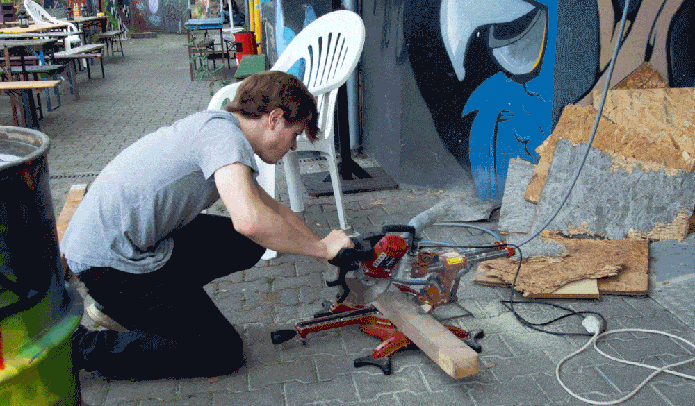

# Verein

<!---->

Um unser langfristiges Ziel zu erreichen, einen Hackerspace zu gründen, haben wir uns 2023 als eingetragener Verein gegründet. 
Dabei suchen wir aktiv nach geeigneten Standorten für unseren Space. Wenn du uns dabei unterstützen möchtest, bist du herzlich eingeladen, an unseren offenen Treffen teilzunehmen oder dich mit uns in Verbindung zu setzen.  
Wir suchen ständig nach neuen Mitgliedern und helfenden Händen, um unsere Ziele zu erreichen.

## Mitglied werden

Hier findest du unsere [Satzung](https://wiki.binhacken.de/index.php/Verein/Satzung) und die [Beitragsordnung](https://wiki.binhacken.de/index.php/Verein/Beitragsordnung).  

Du kannst unseren Mitgliedsantrag online ausfüllen: 
1. Öffne unser [Vereinsprofil](https://web.meinverein.de/profile/66336)
2. Auf dieser Seite klicke auf den Button "Beitreten"
3. Jetzt kannst du den Mitgliedsantrag ausfüllen und absenden.

Alternativ kannst du auch den [Mitgliedsantrag als PDF](/assets/mitgliedsantrag.pdf) ausfüllen und uns per Email (siehe Homepage) schicken.

## Warum machen wir das

Wir möchten einen Hackerspace gründen, weil es nur wenige Orte gibt, an denen sich Schüler, Studierende und Erwachsene kostengünstig weiterbilden können. Gerade wenn es um praktisches Lernen und Experimentieren geht, braucht es Werkzeug, und nicht jeder hat Zugang dazu.  

Wir möchten einen Ort, an dem wir unabhängig sind und in einer sicheren Umgebung lernen, lehren, machen, hacken und testen können, und wo alle willkommen sind. Ein Ort um Projekte und Ideen in einer toleranten und unterstützenden Umgebung umzusetzen und wo auch spontan Vorträge und Workshops entstehen können.  

Unsere wöchentlichen Treffen und gelegentlichen Veranstaltungen sorgen schon für Gemeinschaft und Zusammenarbeit, ersetzen aber nicht den anderen essentiellen Teil eines Hackerspaces - den Space.  

Deshalb suchen wir nach eigene Räumlichkeiten, an dem wir dauerhaft Equipment und Infrastruktur zur Verfügung stellen und teilen können.  